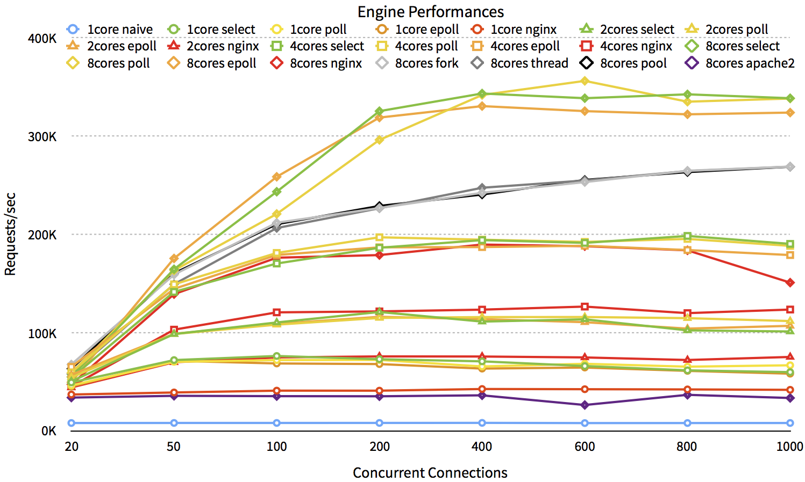
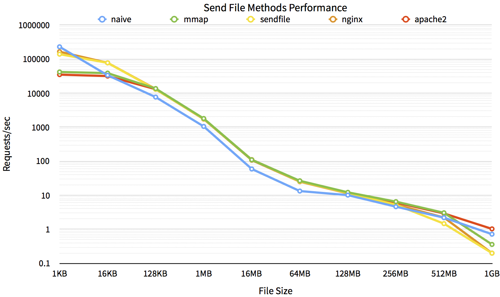

# HTTP Server 结题报告

## HTTP Server 是什么

当我们用浏览器打开一个网页的时候，浏览器发出了一个 TCP 连接到服务器，这个连接使用 HTTP 协议描述了它的请求信息。接着，服务器收到了这个连接，找到相应的资源，仍然按照 HTTP 协议把它包装好，把包装好的信息通过刚才的 TCP 连接传回浏览器。于是浏览器就拿到了网页的内容。

HTTP Server 就是在上述过程中负责接受客户端的连接、寻找资源和发回数据的程序，从网络服务器的角度来看，他其实就是个 TCP Server。

## HTTP Server 的挑战

HTTP Server 的挑战集中于性能方面，尤其是对并发连接的处理能力上面。比方说，每个连接持续时间为10秒，每秒有1000个连接涌入服务器，那么服务器就得有同时处理10000个连接的能力。这就是在2000年左右被提出来的 [C10K](https://en.wikipedia.org/wiki/C10k_problem) 问题。

提升 HTTP Server 的并发能力，并不能简单地通过提升硬件性能来解决。在软件方面，有非常多可以改进的地方。因为程序对网络的操纵都是通过操作系统的接口来进行的，因此要提升 HTTP Server 的并发能力，需要硬件、操作系统和应用程序自下而上共同努力。

十几年前的 C10k 问题如今已经不成问题了，解决 C10K 问题的方法如今也成为了每个服务器软件标配的方法。我们这一操作系统的大作业不追求更高的性能（如现在的 [C10M](http://c10m.robertgraham.com/p/manifesto.html) 问题），仅在理解清楚当初 C10k 问题的解决方法，也就是当今服务器软件的基础。

## HTTP 协议简介

HTTP 协议是基于纯文本的协议，协议本身也非常简单。下面简要介绍一下 HTTP 协议。

### HTTP Request

HTTP Request 即客户端发送给服务器的请求。整体上来说，它可以分为三部分，每一部分由 CRLF 即 `\r\n` 隔开：

* Statue Line
    * 包含 HTTP Method, Request URI 和 HTTP Version 三个部分，由空格隔开。
    * HTTP Method 包含了 `GET` 和 `POST` 等。
    * Request URI 即请求的路径。
    * HTTP Version 表明了所使用的 HTTP 协议版本。现在常用的是 `HTTP/1.1`。
* Headers
    * 由键值对组成的列表。键值之间用冒号分隔。
    * 列表项之间由 CRLF 分隔。
    * 最后单独的一行 CRLF 表征 Headers 结束。
* Body
    * 请求的主体。
    * 对于 `GET` 方法来说，请求的主体应为空，因为请求的路径包含在 Status Line 中。
    * 对于 `POST` 方法来说，请求的主体所使用的编码应在 Headers 中说明，一般为 `application/x-www-form-urlencoded`

下面举一个例子：

```
POST /acmcabbs/member.php?mod=logging&action=login HTTP/1.1
Host: 202.120.38.22:1000
Connection: keep-alive
Content-Length: 115
Cache-Control: max-age=0
User-Agent: Mozilla/5.0 (Macintosh; Intel Mac OS X 10_12_1)
            AppleWebKit/537.36 (KHTML, like Gecko)
            Chrome/54.0.2840.98 Safari/537.36
Upgrade-Insecure-Requests: 1
Content-Type: application/x-www-form-urlencoded
Referer: http://202.120.38.22:1000/acmcabbs/forum.php

username=abcdabcd987&password=p@ssw0rd
```

可以看到，这是一个使用 POST 方法访问 `http://202.120.38.22:1000/acmcabbs/member.php?mod=logging&action=login` 的例子。从请求主体中，我们可以看到用户登入时所使用的用户名和密码为 `abcdabcd987` 和 `p@ssw0rd`。


### HTTP Response

HTTP Response 即为服务器响应客户端的数据。它与 HTTP Request 非常类似：

* Status Line
    * 由 HTTP Version, Status Code 和 Status Name 组成。
    * 常见的 Status Code/Name 组合有 `200 OK`, `302 Moved Temporarily`, `404 Not Found`, `500 Server Error` 等等
* Headers
* Body
    * 如果在 Header 中指定了 `Transfer-Encoding: chunked` 则主体内容使用分块编码方式。
        * 每个块先用16进制给出块的长度，紧接一个 CRLF，之后是块的内容。
        * 长度为0的块用来表征内容结束。
        * 在内容结束之后可以追加 Headers
    * 否则在 Header 中应该指定 `Content-Length` 即主体内容的长度。

下面举两个例子，这两个例子中的主体内容是等价的：

```
HTTP/1.1 200 OK
Date: Fri, 31 Dec 1999 23:59:59 GMT
Content-Type: text/plain
Transfer-Encoding: chunked

1a; ignore-stuff-here
abcdefghijklmnopqrstuvwxyz
10
1234567890abcdef
0
some-footer: some-value
another-footer: another-value

```

```
HTTP/1.1 200 OK
Date: Fri, 31 Dec 1999 23:59:59 GMT
Content-Type: text/plain
Content-Length: 42
some-footer: some-value
another-footer: another-value

abcdefghijklmnopqrstuvwxyz1234567890abcdef

```

### HTTP Keep-Alive

因为在打开一个网页时，往往需要向同一个服务器进行请求多次资源（如额外的样式、脚本、图片文件等等），因此 HTTP 协议中允许一个 TCP 连接在完成一次交互之后不立即关闭，而是继续用作下一次交互。

在 `HTTP/1.0` 中，要使用 HTTP Keep-Alive，需要在 HTTP Request Header 中加入 `Connection: Keep-Alive`。

在 `HTTP/1.1` 中，默认使用 HTTP Keep-Alive。如果服务器需要提前关闭连接，需要在 HTTP Response Header 中加入 `Connection: Close`。

HTTP Keep-Alive 无疑可以加快载入网页的速度，提升用户体验，但也增大了 HTTP Server 的负担——每个 TCP 连接的生命周期变长了。


## I/O 模型1：最简单的 HTTP 服务器

因为 HTTP Server 是一个 I/O 密集型的程序，所以 I/O 模型的选择对性能的影响是巨大的。从本节开始，我们将逐个考察各种 I/O 模型，一步一步提升 HTTP Server 的并发能力。在每个模型中，我们都给出核心的伪代码。

最简单的 TCP 服务器，如同教科书上示范使用 socket 编程一样，就是使用 `accept()` 接受一个连接，之后处理这个连接相关的事务，直到最后关闭连接。

```
// serve forever
for (;;) {
    // accept a connection
    int infd = accept(sfd, NULL, NULL);
    
    // deal with the connection, until it finishes
    bool done = false;
    while (!done) done = do_request(infd);
    
    // then close the connection
    close(infd);
}
```

这个例子固然简单，然而问题也是显而易见的。我们用个现实世界的场景来做类比，HTTP Server 类似于一个快餐店，每一个连接相当于来店里吃饭的顾客。现在店里只有老板自己一人，所以每来一个顾客，他就得去记下顾客要什么，然后去厨房做吃的。注意到，当老板忙着服务前一个顾客的时候，他就顾不上其他顾客了，所以其他顾客只能排队等待。

放在 HTTP Server 上面来说，如果上一个连接还未完成，则下一个连接只能等待，直到上一个连接完成。也就是说，这个 HTTP Server 只能处理一个（并发）连接。

当客户较少的时候，这样的模型还是可以支撑的。而如果客户不断涌入的话，显然，无论是独自一人的快递店老板还是我们简单的 HTTP Server，都无法满足大量的请求的。

## I/O 模型2：使用多进程

既然上面的做法无法同时服务多个连接，很自然的想法就是使用多进程。因为 `fork()` 创建子进程的时候会连同打开的文件描述符一起复制，而 socket 在 Linux 中也被当作文件对待，所以我们可以在接受一个连接之后，创建一个子进程来处理这个连接相关的事务，同时父进程继续等待接受其他连接。

```
// serve forever
for (;;) {
    // accept a connection
    int infd = accept(sfd, NULL, NULL);

    pid_t pid = fork();
    if (pid == 0) {
        // child: deal with the connection, until it finishes
        bool done = false;
        while (!done) done = do_request(infd);
        close(infd);
    } else {
        // parent: close the duplicated fd
        close(infd);
    }
}
```

想象刚才这个快餐店边上就是一个巨大的劳动力市场。老板觉得自己累死累活还不能满足客户的需求，不如雇一点临时工。于是，老板专门在前台接待客户。每来一个客户，老板就向边上的人才市场招招手，雇一个临时工去厨房里做吃的。在把吃的交给客户之后，老板一手把劳务费交给临时工，一手就送走了临时工。

这个做法虽然简单粗暴，但是在一般的情况下它的性能还是可以接受的。

这个做法的缺点也很容易看出来。创建大量的进程会使得调度成本增加。消耗在创建和销毁进程的额外成本也是很可观的。

不过值得注意的是，在当今多核处理器越来越普遍的情况下，使用多进程可以利用多核处理器的优势。

## I/O 模型3：使用多线程

既然进程的创建和销毁成本很大，那我们可以使用稍微轻量级一点的线程。

```
// deal with the connection, until it finishes
void* work(void *arg) {
    int infd = (int)arg;
    bool done = false;
    while (!done) done = do_request(infd);
    close(infd);
}

// serve forever
for (;;) {
    // accept a connection
    int infd = accept(sfd, NULL, NULL);

    // create a worker thread to deal with the connection
    pthread_t thread;
    pthread_create(&thread, &attr, work, (void*)infd);
}
```

这就相当于快餐店旁边有一个更近、费用更便宜的劳动力市场。

## I/O 模型4：使用线程池

模型3相比模型2，降低了创建和销毁工人的开销。进一步地，我们还可以预先创建好一些线程，让他们长期运行。每当服务器接受了一个新的连接之后，将这个连接派发给其中一个工作线程来处理即可。

```
void work() {
    // work forever
    for (;;) {
        // receive a task from the pool
        int infd = next_task();

        // deal with the connection, until it finishes
        bool done = false;
        while (!done) done = do_request(infd);
        close(infd);
    }
}

// create a thread pool
ThreadPool pool(num_worker, work);

// serve forever
for (;;) {
    // accept a connection
    int infd = accept(sfd, NULL, NULL);

    // dispatch the connection to a worker in the pool
    pool.new_task(infd);
}
```

快餐店老板发现每次雇临时工非常麻烦，于是在开张之前就招了一些正式的合同工，集中培训。营业时，老板在前台接受客户的请求，然后派一个伙计去厨房做吃的。老板和这些伙计们建立了深厚的情谊（合同），直到最后关店才和伙计们说再见。

相比起前面的模型，线程池有好的地方也有不好的地方。好的地方自然是没有了额外的创建和销毁线程的开销。然而，当所有伙计都在厨房做吃的的时候，新来的客户依然只能等待。而如果招聘临时工的话，就没有这个问题。另外，在开张之初要招聘多少伙计，这也是一个需要权衡的问题。

## I/O 模型5：非阻塞 I/O

在前面的伪代码中，我们都没有描写处理连接的过程。在处理连接的过程中，固然是包含了对请求资源的查找、计算等实实在在消耗 CPU 计算资源的工作，然而也包含了从客户端接收数据和往客户端发送数据的过程。写成伪代码类似于：

```
bool do_request(int infd) {
    // read the request
    Request req;
    read(infd, req.buffer, req.buffer_size);
    
    // make a response
    Response resp = do_computation(req);
    
    // send back the response
    write(infd, resp.content, resp.size);
    
    // return true to close the connection
    return resp.close_connection;
}
```

实际上，`read`/`write` 并不怎么消耗 CPU 计算资源，然而因为通信的原因，它们消耗的时间常常远超前者。当程序控制流执行到 `read`/`write` 的时候，进程就会被操作系统挂起，直到这个 I/O 操作结束。我们称这样的 I/O 操作是阻塞的（Blocking）。

注意到之前的所有模型都存在这个问题，只不过它们让子进程或者线程执行阻塞的 I/O 操作，保证主线程依然能接受新的连接，从而看起来并不受这个问题的影响。

很自然地我们可以想到，如果操作系统提供了非阻塞 I/O（Nonblocking I/O），那么我们完全可以在一个 I/O 操作进行的时候去做别的事情。以读取为例，我们希望调用 `read` 的时候，如果此时已经有数据在缓冲区中，程序可以直接拿到数据；如果此时缓冲区仍然是空的，那么系统应该告诉我们此时没有数据。这样一来，我们就可以腾出手去处理其他事情了。哪怕只有单线程，处理速度也很快。写成伪代码：

```
// file descriptors to be watched
List<int> watch_fds;
make_nonblocking(sfd);
watch_fds.add(sfd);

// serve forever
for (;;) {
    // for each file descriptor that we are watching
    for (int fd : watch_fds)
        if (fd == sfd) {
            // if is the socket fd
            if (is_acceptable(sfd)) {
                // if there is a new connection
                int infd = accept(sfd);
                make_nonblocking(infd);
                watch_fds.add(infd);
            }
        } else {
            // otherwise it is a connection
            if (is_readable(fd))
                read_and_process(fd);
            if (is_writeable(fd)) {
                bool done = process_and_write(fd);
                if (done) {
                    close(fd);
                    watch_fds.remove(fd);
                }
            }
        }

    if (done_nothing)
        sleep(some_duration);
}
```

回到快餐店的例子。现在顾客们不是到窗口点餐了，而是通过饿了么之类的订餐软件在网上订餐。这样一来，送餐时间相比做快餐的时间就是长得多的概念了。操作系统就类似于饿了么，`accept` 就类似于在网页上查看是否有新的订单，`write` 就类似于让蜂鸟专送。为了类比 `read`，我们不妨假设这个“饿了么”的设计比较奇怪，客户可以不断订新的吃的，直到最后确认不再追加。商家也是实时地收到追加中的订单，也就是说，商家可能先看到有了一个新客户，然后他要了一个汉堡，然后要了个鸡肉卷，然后又点了一些其他的，最后才确认说一共就这么些东西。

快餐店只有老板一人，老板定期盯着饿了么的网页。如果有新的客户的话，他把这个客户记下来。同时，他也在网页上查看所有还没结束订单的客户，看看他们有没有订了新的吃的，如果有的话就赶快去做吃的。如果一个客户确认订单了，那他就让蜂鸟专送的骑手把完整的快餐送出去。如果没有什么事情可以做的话，老板就去看一会儿电视，过会儿再过来查查有没有新订单。

注意到一个订单的生命周期是从下单到配送完毕。在之前的模式中，如果只有老板一人，他又要接单又要做饭又要亲自配送，所以同时只能服务一个客户。而现在，他在让骑手送出去之后，又可以服务下一个客户了。

这个方法也有它的缺陷。我们看到它的行为模式类似于一种忙等待（Busy Waiting），如果我们查询的间隔过长，那么可能会使得部分连接等待得过久；而如果询问的时间间隔过短，那么又会消耗大量的 CPU 资源于无用的查询中。另外，注意到我们每次都需要扫一遍整个监视列表，这也是非常费力的事情。

## I/O 模型6：I/O 多路复用之 `select()`

上面我们不断轮询是否有连接就绪，这件事情一看就是非常费力不讨好。我们当然希望操作系统能直接提醒我们某些文件描述符已经就绪了，毕竟操作系统是第一个知道这件事的。这样能同时监视多个文件描述符，让操作系统在文件描述符就绪的时候通知程序的机制，就叫做 I/O 多路复用（I/O Multiplexing）。多路复用的意思就是说，我们可以同时处理多个 I/O 操作。其实上面非阻塞的方式已经能够同时处理多个 I/O 操作了，只不过当 I/O 就绪的时候系统不会自动通知我们。

实现 I/O 多路复用，最经典的接口就是 `select()`，它几乎在主流的操作系统上都有实现。`select()` 使用 `fd_set` 来指定要监听的文件描述符。因为文件描述符总是取最小的空闲的自然数，所以 `fd_set` 的实现相对简单，基本上来说都是使用 Bitmap。`select()` 的函数原型是

```
int select(int nfds,
           fd_set *readfds, fd_set *writefds, fd_set *errorfds,
           struct timeval *timeout)
```

`nfds` 是最大的文件描述符编号。三个 `fd_set` 分别是三种不同的监视类型，分别是可读、可写和发生异常。最后一个时间结构体描述的是等待超时的时间，指定为 `NULL` 则为永不超时（即阻塞在 `select()` 上面）。

在调用 `select()` 前，需要先设置好 `fd_set`。`select()` 会返回有事件发生的文件描述符个数，同时将相应的 `fd_set` 中相应位置成1，否则置成0。

使用 `select()` 的伪代码如下：

```
fd_set socks, readfds, exceptfds;
make_non_blocking(sfd);

// watch `sfd`
int maxsock = sfd;
FD_ZERO(&socks);
FD_SET(sfd, &socks);

// serve forever
for (;;) {
    // copy the watching fd set to two seperate fd_set
    memcpy(&readfds, &socks, sizeof(socks));
    memcpy(&exceptfds, &socks, sizeof(socks));

    // block on `select` until some events occur
    select(maxsock+1, &readfds, NULL, &exceptfds, NULL);

    // find out whom that events occur at
    for (int fd = 0; fd <= maxsock; ++fd)
        if (FD_ISSET(fd, &exceptfds)) {
            // if an exception occur
            close(fd);
            FD_CLR(fd, &socks); // don't watch `fd` anymore
        } else if (FD_ISSET(fd, &readfds)) {
            // if readable
            if (fd == sfd) {
                // if there is a new connection
                while (is_acceptable(sfd)) {
                    int infd = accept(sfd);
                    make_nonblocking(infd);
                    FD_SET(infd, &socks); // watch `infd`
                }
            } else {
                // otherwise it is a connection
                bool done = read_and_process(fd);
                if (done) {
                    close(fd);
                    FD_CLR(fd, &socks); // don't watch `fd` anymore
                }
            }
        }
}
```

这就好比快餐店老板原先总是时不时地要在网页上看看有没有新的订单，现在饿了么每当有新订单的时候就会发出一声响，老板听到铃响再去查看网页就好了。

`select()` 也有一些比较明显的缺点。一是 `fd_set` 的大小 `FD_SETSIZE` 是定死的常数，所以 `select()` 能同时监视的文件描述符有一个上限。另外，在使用的时候，`select()` 会在原地修改 `fd_set`，所以下次要再调用 `select()` 前必须重新设置好 `fd_set`。最后，最令人恼火的是，尽管 `select()` 会告诉我们有多少文件操作符就绪了，但是它却不能告诉我们具体是哪些，我们不得不手动检查整个集合。

## I/O 模型7：I/O 多路复用之 `poll()`

相比 `select()`，`poll()` 做了一点点小改进。

```
int poll(struct pollfd fds[], nfds_t nfds, int timeout);
struct pollfd {
    int    fd;       /* file descriptor */
    short  events;   /* events to look for */
    short  revents;  /* events returned */
};
```

`fds` 是一个 `struct pollfd` 数组，我们将要监视的文件描述符写在 `fd` 域中，将我们关注的事件写在 `events` 域中，`poll()` 返回时会将发生的事件记录在 `revents` 中。`nfds` 是数组的长度。`timeout` 用来指定超时时间。

可以看到 `poll()` 解决了 `select()` 的前两个问题：需要监听多少文件描述符就传入多大的数组，另外数组本身也可以不断地重用。整体上，使用 `poll()` 的代码与使用 `select()` 也非常接近：

```
make_non_blocking(sfd);
struct pollfd *pollfds = (struct pollfd *)calloc(sizeof(struct pollfd), backlog);

// watch `sfd`
int nfds = 0;
pollfds[nfds++] = {.fd = sfd, .events = POLLIN};

// serve forever
for (;;) {
    // block on `poll` until some events occur
    poll(pollfds, nfds, -1);

    // find out whom that events occur at
    for (int i = 0; i < nfds; ++i) {
        struct pollfd *pfd = &pollfds[i];
        if (!pfd->revents)
            continue; // nothing happens to `pfd->fd`
        if (!(pfd->revents & POLLIN)) {
            // if an exception occur
            close(fd);
            pollfds[i--] = pollfds[--nfds]; // don't watch `pfd->fd` any more
        } else {
            // if readable
            if (pfd->fd == sfd) {
                // if there is a new connection
                while (is_acceptable(sfd)) {
                    int infd = accept(sfd);
                    make_nonblocking(infd);
                    pollfds[nfds++] = {.fd = infd, .events = POLLIN};
                }
            } else {
                // otherwise it is a connection
                bool done = read_and_process(pfd->fd);
                if (done) {
                    close(pfd->fd);
                    pollfds[i--] = pollfds[--nfds]; // don't watch `pfd->fd` any more
                }
            }
        }
    }
}
```

## I/O 模型8：I/O 多路复用之 `epoll`

`epoll` 是一个 Linux 上独有的机制，它类似于 `poll()`，但是它好在不但能告诉我们有多少事件发生了，还能准确地告诉我们事件是在哪些文件描述符上发生的。

```
int epoll_create1(int flags);
int epoll_ctl(int epfd, int op, int fd, struct epoll_event *event);
int epoll_wait(int epfd, struct epoll_event *events, int maxevents, int timeout);
struct epoll_event {
    uint32_t     events;      /* Epoll events */
    epoll_data_t data;        /* User data variable */
};
typedef union epoll_data {
    void    *ptr;
    int      fd;
    uint32_t u32;
    uint64_t u64;
} epoll_data_t;
```

`epoll` 系列的函数主要有以上这三个，参数的含义很容易猜到。在使用 `epoll_create1()` 创建了一个 epoll fd 之后，对监视的文件描述符集合的操作都是通过 `epoll_ctl()` 进行。调用 `epoll_wait()` 可以等待事件的发生。

有趣的的两个辅助的类型。`epoll_data` 用来保存数据，它可以是如上所示的四种类型之一。在增加监视的文件描述时，通过 `epoll_event` 可以指定关心的对象，以及附加的数据。当 `epoll_wait()` 返回了发生的事件后，对应数组中的 `events` 的相应位会被标记上，同时 `data` 也会被设置为设置监视时指定的 `data`。`data` 可以是 `void*` 类型，所以它可以存储任何复杂的数据，这也带来了很大的方便。

使用 `epoll` 的代码和前面两份代码非常类似，但不同的是，此时我们无须检查所有监视中的文件描述符，而只要处理那些有事件发生的即可。

```
make_non_blocking(sfd);
struct epoll_event event;
struct epoll_event *events = (struct epoll_event *)calloc(sizeof(struct epoll_event), backlog);
int efd = epoll_create1(0);

// watch `sfd`
event = {.data = {.fd = sfd}, .events = EPOLLIN | EPOLLET};
epoll_ctl(efd, EPOLL_CTL_ADD, sfd, &event);

// serve forever
for (;;) {
    // block on `epoll_wait` until some events occur
    int n = epoll_wait(efd, events, backlog, -1);

    // process each event
    for (int i = 0; i < nfds; ++i) {
        int fd = events[i].data.fd;
        uint32_t events = events[i].events;
        if ((events & EPOLLERR) || (events & EPOLLHUP) || (!(events & EPOLLIN))) {
            // if an exception occur
            close(fd); // automatically unwatch `fd`
        } else {
            // if readable
            if (pfd->fd == sfd) {
                // if there is a new connection
                while (is_acceptable(sfd)) {
                    int infd = accept(sfd);
                    make_nonblocking(infd);
                    event = {.data = {.fd = infd}, .events = EPOLLIN | EPOLLET | EPOLLONESHOT};
                    epoll_ctl(efd, EPOLL_CTL_ADD, infd, &event); // watch `infd`
                }
            } else {
                // otherwise it is a connection
                bool done = read_and_process(fd);
                if (done) {
                    close(fd); // automatically unwatch `fd`
                } else {
                    event = {.data = {.fd = fd}, .events = EPOLLIN | EPOLLET | EPOLLONESHOT};
                    epoll_ctl(efd, EPOLL_CTL_MOD, fd, &event); // watch `infd` again
                }
            }
        }
    }
}
```

使用了 `epoll` 的程序非常高效，能够轻松地应付海量的连接。在2003年左右，Nginx 就是这样轻松解决 C10K 问题，并打败 Apache 的。

虽然 `epoll` 是 Linux 特有的机制，但是在其他平台上一样有高效的类似的机制：

* 在 Windows 上有 Input/Output Completion Port
* 在 BSD 上有 `kqueue`
* 在 Solaris 上有 `/dev/poll`

## I/O 模型9：I/O 多路复用 + 多线程

上面这几种 I/O 多路复用的模型都是在单线程上面工作的，就已经能达到非常好的效果。很自然地，我们会想到在这上面再加入多线程。因为这些 I/O 多路复用的系统调用都是线程安全的，所以我们可以大胆地开若干个工作线程，都执行上面的程序。

使用 I/O 多路复用后，HTTP Server 可以用上100%的CPU资源。因此，工作线程的数量大于CPU核心数量是没有意义的，反而会增加额外的开销。

```
void* work(void *args) {
    // run epoll engine described above
    engine_epoll(sfd);
}

// create a socket
int sfd = socket(domain, socktype, 0);
bind(sfd, (struct sockaddr *) &addr, addrlen);

// create workers
pthread_t threads[num_worker];
for (int i = 0; i < num_worker; ++i)
    pthread_create(&threads[i], NULL, work, NULL);

// sleep forever
for (int i = 0; i < num_worker; ++i)
    pthread_join(threads[i], NULL);
```

这有点类似于快餐店的老板找了几个和自已一样熟练的合伙人，他们一块都听着饿了么提醒，并且分配工作的时候也不会重复、不会遗漏。

## I/O 模型10：I/O 多路复用 + `SO_REUSEPORT`

`SO_REUSEPORT` socket 选项是 Linux 3.9 内核的一个新特性。它使得多个进程可以监听同一个地址的同一个端口。也就是说，我们可以把上面例子中的多线程改成多进程。

为什么要怎么做呢？在实践中，人们发现，当多个线程 `accept()` 同一个 socket 的时候，每个线程被分配到的任务的数量可能会非常不平均。使用 `SO_REUSEPORT`，内核可以保证各个进程被分配到的任务是均匀的。

```
// create workers
for (int i = 0; i < num_worker; ++i) {
    if (fork() == 0) {
        // child: create a socket with SO_REUSEPORT option
        int sfd = socket(domain, socktype, 0);
        int optval = 1;
        setsockopt(sfd, SOL_SOCKET, SO_REUSEPORT, &optval, sizeof(optval));
        bind(sfd, (struct sockaddr *) &addr, addrlen);

        // run epoll engine described above
        engine_epoll(sfd);
        return;
    }
}

// sleep forever
for (int i = 0; i < num_worker; ++i)
    wait(NULL);
```

## 减少内存拷贝：`mmap()`

介绍完了几种 I/O 模型之后，我们介绍其他一些提升 HTTP Server 性能的方法。

在 HTTP Server 找到了请求的文件后，它要将文件发回给客户端。通常的做法就是打开文件，每次读取文件的一部分，再发送给客户。

```
struct stat stat;
char buf[BUFSIZE];
int srcfd = open(filename, O_RDONLY, 0);
fstat(srcfd, &stat);
for (ssize_t nwrite = 0; nwrite < stat.st_size; ) {
    ssize_t nread = read(srcfd, buf, BUFSIZE);
    nwrite += write(infd, buf, nread);
}
```

然而我们知道，用户态程序并不能直接访问内核态的数据，数据必须经历一次从内核态复制到用户态的过程，反之亦然。因此，这一来一回，一段数据就被多复制了两次。当文件很大时，这样额外的复制工作也会成为明显的负担。

使用 `mmap()` 可以将文件映射到虚拟地址空间中，如同访问数组一样，无须再多次调用 `read()`/`write()`。

```
struct stat stat;
char buf[BUFSIZE];
int srcfd = open(filename, O_RDONLY, 0);
fstat(srcfd, &stat);
void *srcaddr = mmap(NULL, stat.st_size, PROT_READ, MAP_PRIVATE, srcfd, 0);
close(srcfd);
write(infd, srcaddr, stat.st_size);
munmap(srcaddr, sbuf.st_size);
```

因为 `mmap()` 是通过 Page Fault 机制来实现的，所以我们的程序有可能不断触发 Page Fault，在用户态和内核中来回跳转。

## 减少内存拷贝：`sendfile()`

Linux 提供了一个非常好用的系统调用 `sendfile()` 可谓是一劳永逸。它让内核直接把内容从一个文件描述符搬运到另一个文件描述符。

```
struct stat stat;
char buf[BUFSIZE];
int srcfd = open(filename, O_RDONLY, 0);
fstat(srcfd, &stat);
sendfile(infd, srcfd, NULL, stat.st_size);
close(srcfd);
```

## 减少内存拷贝和 TCP I/O：`writev()`

在实现 HTTP Response Header 的时候，我们很自然地会想到使用键值对列表。然而这就给输出造成了一定的麻烦。

最朴素的方法是分别对每个键每个值调用一次 `write()`。然而这样一来，频繁调用系统调用，会使程序来回在用户态和内核态切换，造成严重的性能问题。另一方面，频繁发送非常短的数据，会使得网络性能非常低下。

为了解决这个问题，很自然地想法就是在用户态进行字符串拼接，拼成完整的 HTTP Response Header 之后再进行一次 `write()`。注意到字符串拼接实际上相当于把每个字符串额外地复制了一份。如果我们想要避免这个额外的开销，我们可以使用 `writev()` 系统调用。

```
ssize_t writev(int fildes, const struct iovec *iov, int iovcnt);
struct iovec {
    char   *iov_base;  /* Base address. */
    size_t iov_len;    /* Length. */
};
```

`writev()` 中的 `v` 代表是向量，也就是说这个函数可以一次性地写入（发送）多个字符串。从函数签名中我们很容易理解，就是指定每个字符串的起始位置和长度即可。

## TCP 调优：`TCP_NODELAY` 和 `TCP_CORK`

在我们写完程序进行压力测试时，我们发现我们的性能远远落后于 Nginx 和 Apache。于是我们使用 `strace` 追踪了这两者的系统调用，发现了 Nginx 开启了 `TCP_CORK`，而 Apache 开启了 `TCP_NODELAY`。

Linux 的 TCP 协议栈默认启用了 [Nagle‘s Algorithm](http://en.wikipedia.org/wiki/Nagle's_algorithm) 和 [TCP Delayed Acknowledgement](http://en.wikipedia.org/wiki/TCP_delayed_acknowledgment)。

Nagle’s Algorithm 通过合并小数据包来提升带宽的利用率。小数据包会被不断积累，直到收到了之前某个包的 ACK。

TCP Delayed Acknowledgement 则是延迟 ACK 的发送时间，以希望能聚集多个 ACK 一块发送。

这两者本是为了提高性能而设计的，然而它可能造成短暂的死锁，在高性能服务器中，反而会降低性能。`TCP_NODELAY` 可以禁用 Nagle’s Algorithm。`TCP_CORK` 可以积累数据包，直至积累的数据包大小超过阈值（而不像 Nagle’s Algorithm 还需要等到收到一个 ACK）。

经测试，这两个选项都可以极大地提升服务器性能。

## 传输大文件

当请求的文件较大时，事情就变得更复杂一些了，尤其是当使用了非阻塞式 I/O 的时候。使用了非阻塞 I/O 之后，每次 `write()` 或者 `sendfile()` 并不会完整地将数据发送出去之后才返回，而是将系统的缓冲区填满之后就会返回 `EAGAIN` 错误。我们需要等待这个文件描述符重新变成可写入的状态之后才能往里面写入数据。所以说，我们需要在之前 `epoll` 之类的事件引擎中增加对可写事件的监视。

然而，一旦走上了这条路，程序的逻辑将变得十分混乱。我们需要把传输进度、打开了的文件描述符、临时变量等等都保存下来，然后当事件引擎通知我们可写时，我们需要重新恢复传输。这是使用非阻塞式 I/O 的一个弊端。

不过这也不是不能解决的问题。注意到我们实际上就是被手动保存现场和恢复现场所困扰，而这些事情最好有一个调度器自动帮我们做好。很容易我们可以想到，我们可以引入用户态进程，即协程（Coroutine）。C/C++ 借助各式各样的协程库的帮助，非阻塞式 I/O 的代码编写也可以变得轻松易懂。有的语言甚至在语言层面直接就支持协程，使用起来更加自然。

## 我们的实现

我们实现了大部分上面提及的内容，并且提供了开关来选择各种参数，方便进行比较。

我们实现了下面的 I/O 模型，在程序中我们称之为 Engine：

* `naive`：模型1，即最简单的例子
* `fork`：模型2，即每接收到一个新连接，创建一个新的子进程来处理
* `thread`：模型3，即每接收到一个新连接，创建一个新的线程来处理
* `pool`：模型4，预先创建好线程池，将每一个新连接派发给一个工作线程处理
* `select`：模型6，即使用 `select()` 事件引擎，单线程
* `poll`：模型7，即使用 `poll()` 事件引擎，单线程
* `epoll`：模型8，即使用 `epoll` 事件引擎，单线程

对于后三个 Engine，我们还支持两种利用多核处理器的方法：

* 使用多个线程，监听在同一个 socket 上，各自接受并处理新的连接
* 使用多个进程，利用 `SO_REUSEPORT` 选项，各自监听在各自的 socket 上，接受并处理新的连接

对于 TCP 性能调优部分，我们可以单独打开或者关闭 `TCP_NODELAY` 和 `TCP_CORK`。

对于发送文件部分，我们实现了以下三种方法：

* `naive`：读入到缓冲区，再将缓冲区的数据发送出去
* `mmap`：使用 `mmap()` 把文件映射到地址空间上，然后直接发送
* `sendfile`：使用 `sendfile()` 直接发送

使用方法如下所示：

```
usage: naughttpd --port <int>
                 --engine <naive/fork/thread/pool/select/poll/epoll>
                 --backlog <int>
                 --num_workers <int>
                 --reuseport <on/off>
                 --tcp_cork <on/off>
                 --tcp_nodelay <on/off>
                 --sendfile <naive/mmap/sendfile>
```

## 压力测试

我们通过压力测试来检验和对比不同的配置之间的性能。我们在一台服务器上运行 HTTP Server，在另一台服务器上运行压力测试软件 `wrk`。`wrk` 是现在流行的 HTTP Server 性能测试软件，指定了测试时间后，它会不断发送 HTTP 请求给服务器，统计延迟和吞吐量，并且还支持自定义脚本。

我们从 Google Cloud Platform 中购买 Compute Engine 作为服务器。两台服务器都位于 `us-west1-a` 分区，配备 Intel Broadwell 处理器。两台服务器之间的网络连接速率为 10GBps。运行 HTTP Server 的服务器配置了 8 vCPUs 和 7.2GB RAM。运行 `wrk` 的服务器配置了 16 vCPUs 和 14.4GB RAM。

在未特殊说明的情况下，`wrk` 使用16线程、400个并发连接持续30秒请求 HTTP Server 上一个约 1KB 大小的文件。

### TCP 优化

我们测试了 TCP 优化对性能的影响。对于 `TCP_NODELAY` 和 `TCP_CORK` 两个选项打开与否，一共四种组合方式，我们进行了比较：


从图中我们可以发现，在不使用任何优化的时候，有一个 40ms 左右的延迟，这正好是 TCP Delayed Acknowledgement 的默认超时时间。在开启任意一种优化之后，延迟显著下降，吞吐量显著上升。`TCP_CORK` 的效果最好，叠加了 `TCP_NODELAY` 之后反而有所下降。

鉴于这点，在之后的测试中，我们都将开启 `TCP_CORK`。

### Engine 比较

我们比较了我们自己实现的各种 Engine 的性能。作为参照，我们还测试了 Nginx 和 Apache2 的性能。两者都使用 Ubuntu 16.04.1 的包管理器安装，并使用默认配置。

除了用满服务器的8个 CPU 以外，对于能够设定使用 CPU 数量的 Engine (`select`, `poll`, `epoll`, `nginx`) 我们还测试了在不同 CPU 数量情况下的表现。



从图中我们可以看到，我们的实现的效率甚至能达到 Nginx 的两倍。这可能是一种“小而美”的假象——因为我们的功能比起 Nginx 还少了非常多，所以我们拥有更高的性能。不过这至少说明了我们的性能能达到一流的水准。有趣的是 Apache2 的效率则惊人地低，也难怪它原先巨大的市场份额被 Nginx 抢走大半。

`select`, `poll`, `epoll`, `nginx` 的性能基本上与使用的 CPU 数量成正比。

在测试中，`epoll` 并没有表现出对 `select` 和 `poll` 的优势，甚至还微微处于下风。我们猜测这其中的原因是并发连接数还不够多，尽管这对于 HTTP Server 来说已经是非常大的并发量了。

朴素的方法如 `fork` 和 `thread` 出乎意料地有非常不错的表现。我们猜测这其中的原因仍然是并发连接数不够多。

### 发送文件方法比较

我们还比较了三种发送文件的方法，并且把 Nginx 和 Apache2 作为对照一同测试。为了减小操作系统磁盘缓存的命中率，我们对于每一种大小的测试点都生成了总大小为 32GB 的文件，并且编写了一个 `wrk` 的脚本，使得 `wrk` 每次随机访问一个文件。



从图中我们可以看到，朴素的方法效果总是较差。在文件大小较小的时候，各种方法的差距还稍微较大一点；而当文件大小稍微变得大了一点之后，整个网络带宽都被占满了，受制于带宽，差距并不明显；当文件大小非常大的时候，因为使用 `wrk` 测试的时间不足，随机因数很大。

## 参考资料

* 整体思路
    * <http://www.kegel.com/c10k.html>
    * <http://lifeofzjs.com/blog/2015/05/16/how-to-write-a-server/>
* 基本的 HTTP Server
    * <http://www.jmarshall.com/easy/http/>
    * <http://www.paulgriffiths.net/program/c/srcs/echoservsrc.html>
    * <http://www.martinbroadhurst.com/server-examples.html>
    * <http://csapp.cs.cmu.edu/public/ics2/code/netp/tiny/tiny.c>
* `epoll`
    * <https://banu.com/blog/2/how-to-use-epoll-a-complete-example-in-c/>
* `SO_REUSEPORT`
    * <https://lwn.net/Articles/542629/>
* `TCP_NODELAY` 和 `TCP_CORK`
    * <http://stackoverflow.com/questions/3761276/when-should-i-use-tcp-nodelay-and-when-tcp-cork>
    * <http://jerrypeng.me/2013/08/mythical-40ms-delay-and-tcp-nodelay/>
    * <http://baus.net/on-tcp_cork>
* 压力测试
    * <https://github.com/wg/wrk>
    * <http://serverfault.com/a/274271/267780>
    * <https://www.rootusers.com/linux-web-server-performance-benchmark-2016-results/>


